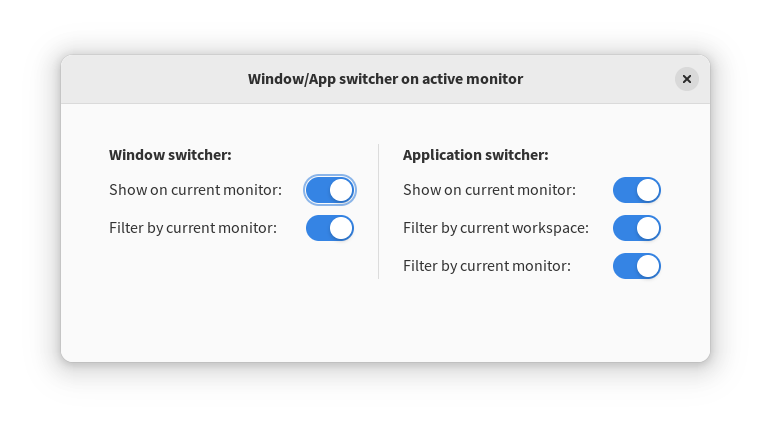

# Monitor window switcher 2

GNOME shell extension to improve the window or application switcher on dual (or more) monitor setups. It has the following options:

- Shows the window or application switcher on the current monitor (instead on primary monitor).
- Filter windows or applications by the monitor they are open on (instead of windows or applications opened in all monitors).
- Filter applications by the workspace they are open on (instead of applications opened in all workspaces).

**Note:** This extension is a fork of https://github.com/gedzeppelin/monitor-window-switcher. I made this fork because the original extension wasn't getting updated for recent GNOME versions. I know almost nothing about JavaScript and GNOME Shell extensions, so I will probably be not able to do much if GNOME does any changes to its extensions API. I also may not be able to fix any bugs if reported. Feel free to do pull requests though!

&nbsp;

Get it on GNOME extensions: https://extensions.gnome.org/extension/4164/monitor-window-switcher/
